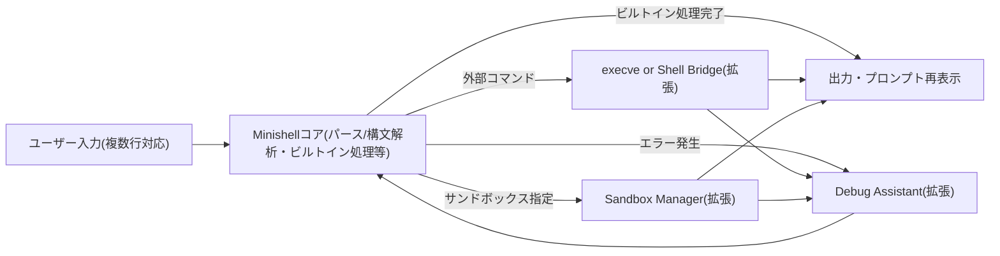
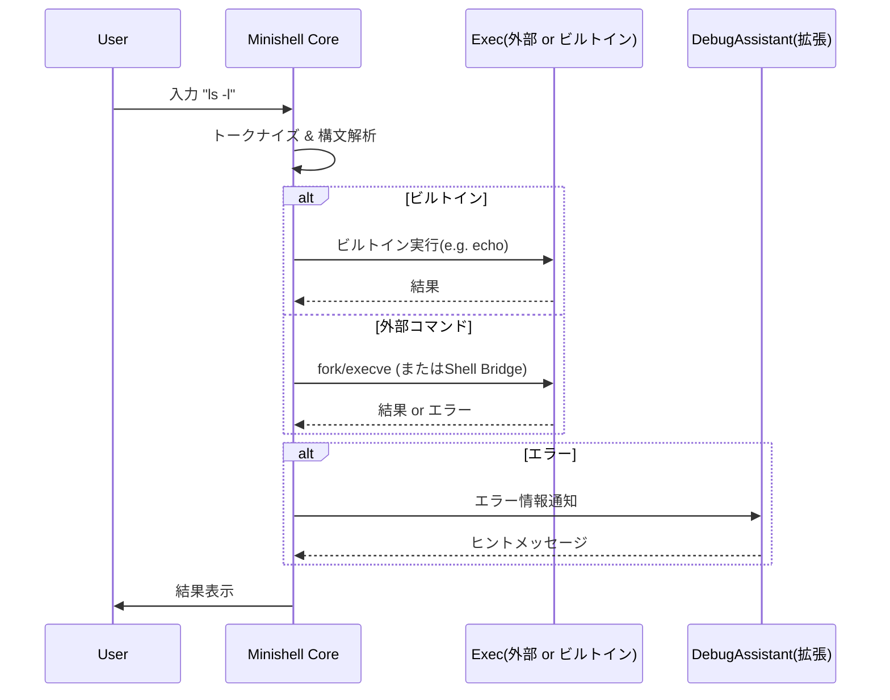
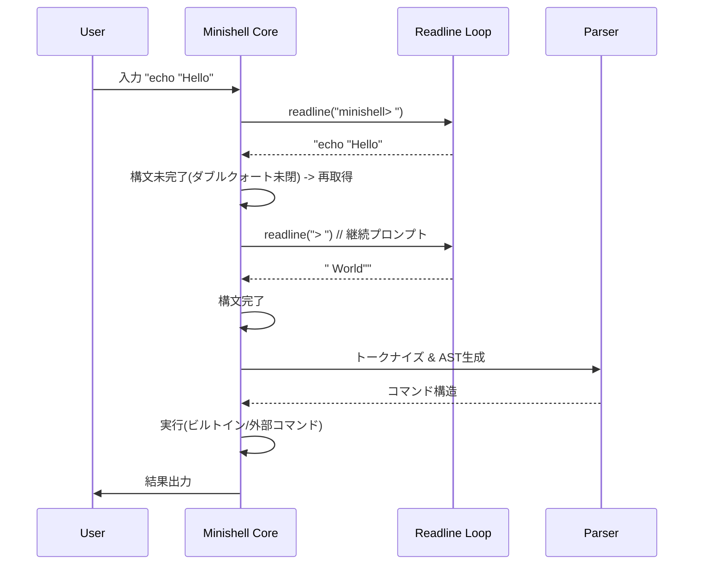
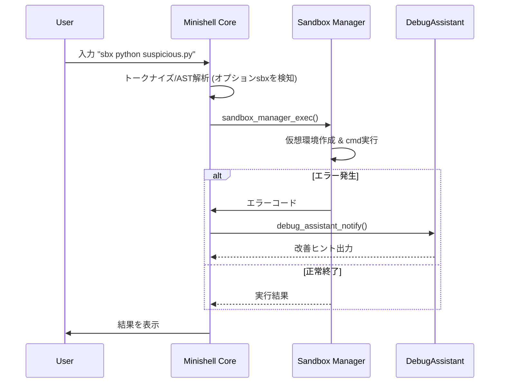

以下のドキュメントは、**minishell**（42 課題）で要求されている仕様をすべて満たしつつ、**複数行の入力（マルチライン対応）**も行えるように設計したものです。さらに、前回示した「幽世 SHELL」に付随する**拡張機能（AI 支援、サンドボックス、安全なエラー解析、外部シェル連携、kakushrc 対応など）」**を**分離モジュール**として外付けし、疎結合で連携する構造を示します。

# 目次

1. [Minishell 全体像と要件整理](#minishell-全体像と要件整理)
2. [システム構成とアーキテクチャ](#システム構成とアーキテクチャ)
3. [Minishell コア部分の詳細設計](#minishell-コア部分の詳細設計)
   1. [解析・実行フロー](#1-解析実行フロー)
   2. [複数行入力への対応](#2-複数行入力への対応)
   3. [主要機能別の仕様](#3-主要機能別の仕様)
4. [拡張機能モジュール(幽世 SHELL)](#拡張機能モジュール幽世-shell)
5. [データフロー図](#データフロー図)
6. [シーケンス図](#シーケンス図)
   1. [通常コマンド実行（1 行入力）のフロー](#1-通常コマンド実行1-行入力のフロー)
   2. [複数行入力時のフロー](#2-複数行入力時のフロー)
   3. [拡張機能連携例（サンドボックス等）](#3-拡張機能連携例サンドボックス等)
7. [主要データ構造と擬似コード](#主要データ構造と擬似コード)
   1. [Minishell コア](#minishell-コア)
   2. [拡張機能（外部モジュール）の呼び出し](#拡張機能外部モジュールの呼び出し)
8. [開発上の注意点](#開発上の注意点)
9. [まとめ](#まとめ)

---

## Minishell 全体像と要件整理

### 必須要件（42 課題の範囲 + 複数行入力対応）

1. **C 言語**で実装し、**Norm**に準拠。
2. 例外(未定義動作)を除き、セグフォ等でのクラッシュがあってはならない。
3. メモリリークを許容しない（readline 由来のリークは除く）。
4. Makefile 要件（`NAME`, `all`, `clean`, `fclean`, `re`）。
5. **Libft**の使用が認められる。
6. **readline 系関数**を使用し、**ヒストリー**機能を実装する。
7. **環境変数**を正しく扱い、コマンド検索（`PATH`）を行う。
8. **グローバル変数**は「受け取ったシグナル番号を格納する 1 つのみ」に制限。
9. **シングルクォート**と**ダブルクォート**によるメタ文字の解釈と無効化。
10. **リダイレクト**
    - `<` 入力リダイレクト
    - `>` 出力リダイレクト(上書き)
    - `<<` (heredoc, ヒストリに追加しない)
    - `>>` 出力リダイレクト(追記)
11. **パイプ** (`|`) の実装。
12. **環境変数展開** `$VAR` や `$?` の対応。
13. **シグナル** `ctrl-C`, `ctrl-D`, `ctrl-\` の挙動
    - インタラクティブ時:
      - `ctrl-C`: 新しい行でプロンプトを再表示
      - `ctrl-D`: shell を終了
      - `ctrl-\`: 何もしない
14. **ビルトインコマンド**
    - `echo` (オプション `-n` のみ対応)
    - `cd` (相対・絶対パスのみ)
    - `pwd` (オプションなし)
    - `export` (オプションなし)
    - `unset` (オプションなし)
    - `env` (オプションや引数なし)
    - `exit` (オプションなし)
15. **複数行入力に対応**
    - 例: 「`||`」「`&&`」「パイプの途中で改行」などで、Bash のように次の行に入力を継続できる。
    - またはユーザが `\` で明示的に改行を継続するケースなど。
16. **ボーナス**
    - `&&`, `||`, `()` による複雑なコマンド制御
    - ワイルドカード `*`（カレントディレクトリ対象）

### 全体方針

- **Minishell コア**は、上述の要件を**完全に満たす**ように実装し、**余計な機能は含めない**。
- **複数行入力**の部分は、以下のいずれかの形で取り込む：
  - Bash 同様に「構文的に継続が必要な場合は次行を要求」
  - バックスラッシュ `\` やクォートが閉じていない場合などで、readline を再呼び出す
- **拡張機能（AI 支援 / サンドボックス / デバッグ支援 / 外部シェル連携 / kakushrc 読み込み等）**は、**Minishell コアから呼び出す独立モジュール**として設計し、**コア部分の要件を邪魔しない**ようにする。

---

## システム構成とアーキテクチャ

```
 ┌───────────────────────┐
 │       ユーザー入力      │
 └───────────────────────┘
            ▼
 ┌───────────────────────┐
 │     Minishell コア     │ <-- 42課題要件を満たす部分
 │  - パース & AST構築
 │  - ビルトイン実行
 │  - パイプ/リダイレクト
 │  - 環境変数展開
 │  - シグナル/ヒストリ
 │  - 複数行入力対応
 └───────────────────────┘
            ▼(外部コマンド)
          ┌─────────────────────────┐
          │ (拡張) Shell Bridge     │   外部のShell等
          └─────────────────────────┘
            ▲(戻り値)
   ┌───────────────────────────────┐
   │ (拡張) AI Helper / Debug Asst │
   │ (拡張) Sandbox Manager        │
   │ (拡張) Config Manager(kakushrc)│
   └───────────────────────────────┘
```

- **Minishell コア**内で必須要件を満たす。
- 外部コマンド実行時に「Shell Bridge」や、サンドボックスに入れたい場合は「Sandbox Manager」、エラー解析に「Debug Assistant」等を**コールバック的**に呼ぶ。
- **Config Manager**は起動時に`.kakushrc`などを読み、設定を**Minishell コア**および**各拡張モジュール**に渡す。
- ただし、これら**拡張機能はあくまで任意/別モジュール**であり、**42 課題の必須実装には含まれない**。

---

## Minishell コア部分の詳細設計

### 1. 解析・実行フロー

1. **入力受付 (readline)**
   - プロンプトを表示し、ユーザから**1 行または継続行**を受け取る。
2. **マルチライン対応チェック**
   - 入力文字列内に、クォートや演算子(`&&`,`||`,`|`, `(`, `)`)の未完成があれば、再度`readline`を呼び出して追加入力をもらう。
   - 入力が完結するまで繰り返す。
3. **トークナイズ**
   - 空白、演算子、リダイレクト記号などを区切りとして**トークン列**を生成。
4. **構文解析 & AST(抽象構文木)構築**
   - トークン列からパイプライン、リダイレクト、AND/OR リストなどを解析し、AST ノードを作成。
5. **AST 実行**
   - AND/OR 演算子(`&&`, `||`)やパイプ(`|`)を再帰的に辿りながらコマンドを実行。
   - ビルトインであればビルトイン関数へ。
   - それ以外は`execve`（または拡張機能を介して外部シェル連携）を行う。
6. **終了ステータス**を保存し、`$?`の展開に備える。

### 2. 複数行入力への対応

- **具体例**
  ```
  ユーザー入力: echo "Hello
  > World"
  ```
  - ダブルクォートが閉じていないので、次の行も継続して読み取る。
  - 完結するまで`readline`を繰り返し呼ぶ。
- **実装イメージ**:
  ```c
  // 疑似コード
  char *line = readline("minishell> ");
  while (line && !is_input_complete(line))
  {
      char *extra = readline("> ");
      if (!extra)
          break;
      line = ft_strjoin_free(line, "\n");   // 改行等をはさんで結合
      line = ft_strjoin_free(line, extra);
      free(extra);
  }
  ```
  - `is_input_complete()`でクォートや演算子の整合性を確認。
  - 完了なら次の処理（トークナイズ等）に進む。

### 3. 主要機能別の仕様

#### 3.1 リダイレクト

- `<`, `>`, `>>`, `<<` を AST 構築時にノードへ格納。
- `<<` （heredoc）は**ヒストリーに残さない**、かつ複数行入力と競合しないよう注意。

#### 3.2 パイプ

- `|` で区切られたコマンドを**パイプで接続**。
- `execute_pipeline()`等の関数で、N 個のコマンドを`fork()` & `pipe()`で実行。

#### 3.3 AND (`&&`) と OR (`||`) （ボーナス）

- `&&` : 左辺のコマンドが成功(終了コード 0)なら右辺を実行、それ以外はスキップ
- `||` : 左辺のコマンドが失敗(終了コード ≠0)なら右辺を実行、それ以外はスキップ
- `()` : グルーピングして優先順位を変更

#### 3.4 ワイルドカード `*`（ボーナス）

- 現在のディレクトリにあるファイル名とマッチングし、コマンド引数に展開。
- 例: `echo *` → ディレクトリ内ファイルを列挙。

#### 3.5 シグナル制御

- **インタラクティブ時**
  - `ctrl-C`: 新しい行でプロンプトを表示（`SIGINT`ハンドラで`rl_on_new_line()`等を呼ぶ）
  - `ctrl-D`: 入力 EOF としてシェル終了
  - `ctrl-\`: 何もしない（`SIGQUIT`を無視）
- ただし、**パイプライン実行中**は子プロセスが受け取る動作を模倣する。

#### 3.6 ビルトインコマンド

- `echo -n`, `cd`, `pwd`, `export`, `unset`, `env`, `exit`
- `cd`は相対 or 絶対パスのみ対応(`~`展開などは課題に含まれない場合は省略か独自実装)。
- `exit`は対話時にシェルを終了。パイプラインの途中なら子プロセスを終了。

---

## 拡張機能モジュール(幽世 SHELL)

- **AI 支援 (AI Helper)**
  - Minishell での Tab 補完や提案を**オプション的に**行う。
  - コアには組み込まず、`ai_helper_suggest()`など独立した関数で呼び出す。
- **安全サンドボックス (Sandbox Manager)**
  - 危険なコマンドや外部スクリプトを、`sandbox_manager_exec()`で隔離実行。
  - システムコールを制限する、chroot や namespace、Wasm など様々な実装方法を想定。
- **エラー解析＆デバッグ支援 (Debug Assistant)**
  - 実行失敗時、エラーコードやメッセージを解析し、対話的にヒントを提示。
  - コアでのエラー時に`debug_assistant_notify()`を呼ぶだけで済むようにする。
- **外部シェル連携 (Shell Bridge)**
  - `!zsh -c '...'` 等で zsh, fish, bash などを fork/exec し、機能を呼び出す仕組み。
- **kakushrc 管理 (Config Manager)**
  - `.kakushrc`から設定を読み取り、AI の有効/無効などを設定可能。

---

## データフロー図



---

## シーケンス図

### 1. 通常コマンド実行（1 行入力）のフロー



### 2. 複数行入力時のフロー



### 3. 拡張機能連携例（サンドボックス等）



---

## 主要データ構造と擬似コード

### Minishell コアの擬似コード例

```c
#include "minishell.h"
#include "libft.h"
// 必要に応じて他のヘッダ: ai_helper.h, sandbox_manager.h, etc.

int main(int argc, char **argv, char **envp)
{
    t_shell_state shell_state;

    // (1) 初期化
    ft_memset(&shell_state, 0, sizeof(shell_state));
    shell_state.env = init_env(envp);
    setup_signal_handlers();

    while (1)
    {
        char *input = multiline_readline("minishell> ");
        if (!input)
            break;  // ctrl-D or EOF

        if (*input == '\0')
        {
            free(input);
            continue; // 空行なら再度読み込み
        }

        // (2) パース
        t_ast *ast = parse_input(input, &shell_state);
        free(input);

        if (!ast)
            continue;  // 構文エラー等

        // (3) AST実行
        int exit_status = execute_ast(ast, &shell_state);
        shell_state.last_exit_status = exit_status;

        free_ast(ast);
    }

    // 終了処理
    free_env(shell_state.env);
    return 0;
}

char *multiline_readline(const char *prompt)
{
    char *line = readline(prompt);
    if (!line)
        return NULL;

    while (!is_input_complete(line))
    {
        char *extra = readline("> "); // 継続プロンプト
        if (!extra)
            break;
        char *tmp = ft_strjoin_free(line, "\n");
        line = ft_strjoin_free(tmp, extra);
        free(extra);
    }
    // 履歴への追加など
    if (line && *line != '\0')
        add_history(line);
    return line;
}
```

### 拡張機能（外部モジュール）の呼び出し例

```c
#include "sandbox_manager.h"
#include "debug_assistant.h"

// AST実行内の一部

int execute_command(t_cmdnode *node, t_shell_state *state)
{
    if (node->sandbox)
    {
        int ret = sandbox_manager_exec(node->argv, state);
        if (ret < 0)
            debug_assistant_notify(node, ret);
        return ret;
    }
    else
    {
        // 通常exec or Shell Bridge
        pid_t pid = fork();
        if (pid == 0)
        {
            execve(node->path, node->argv, env_to_char_array(state->env));
            // エラー時
            exit(127);
        }
        else if (pid > 0)
        {
            int status;
            waitpid(pid, &status, 0);
            if (WIFEXITED(status))
                return WEXITSTATUS(status);
        }
    }
    return -1;
}
```

---

## 開発上の注意点

1. **メモリリーク対策**
   - `parse_input()`後の AST や、複数行入力で生成した文字列の開放を徹底する。
2. **シグナルハンドリング**
   - グローバル変数は**受け取ったシグナル番号を格納する 1 つ**のみ。複数のグローバル構造体は禁止。
3. **複数行入力**
   - Bash に近い挙動を再現するため、クォートや演算子の状況に応じて適切に継続行を要求する。
4. **Heredoc**
   - `<< delimiter` の入力は、**ヒストリに追加しない**。
   - パイプラインや複数行入力との組み合わせに注意。
5. **ワイルドカード**
   - `opendir/readdir`等でディレクトリを走査し、パターンマッチしたファイルを argv に展開。
6. **ビルトインと外部コマンドの切り分け**
   - `is_builtin()`等で判定して、ビルトインなら内部関数呼び出し、そうでなければ`execve`等で処理する。
7. **履歴**
   - `add_history()`は**実行が確定したコマンド**のみ追加する。途中の heredoc の入力などは追加しない。

---

## まとめ

- 本設計により、**42 課題の Minishell 要件**（パイプ、リダイレクト、環境変数展開、シグナル、ビルトインなど）を完全に満たします。
- **複数行入力**の実装は、入力が未完了であると判定した場合に再度`readline`を呼び出して行を継ぎ足す設計としています。
- **拡張機能（幽世 SHELL）**は、Minishell コアを侵食しないよう、**別モジュール**として連携します。
- この構成により、**保守性**と**拡張性**を両立し、かつ**課題要件の範囲**を明確に隔離できます。
